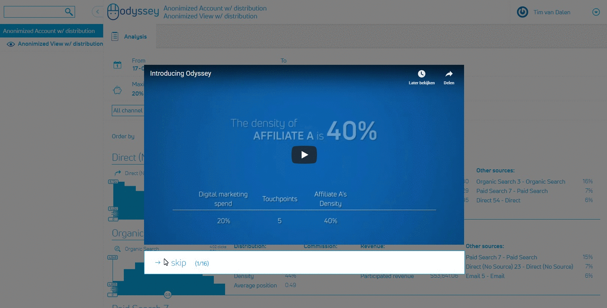

# Telemachy [](https://www.npmjs.com/package/telemachy) [](https://npmjs.org/package/telemachy) [](https://www.npmjs.com/package/telemachy) 

Easy guided tours for Angular apps.



## Table of contents

 * [Getting started](#getting-started)
    + [Installation](#installation)
    + [Usage](#usage)
      - [Persistency](#persistency)
      - [Restarting a tour](#restarting-a-tour)
  * [API](#api)
    + [TelemachyService](#telemachyservice)
    + [TourPersistency](#tourpersistency)
    + [YoutubeTourStep](#youtubetourstep)
    + [HTMLTourStep](#htmltourstep)
    + [ElementTourStep](#elementtourstep)

## Getting started

### Installation

```sh
yarn add telemachy
# or
npm install --save telemachy
```

Import `TelemachyModule` in your root module (make sure the `RouterModule` is loaded, Telemachy uses it to automatically start the tour for any compontent that a user navigates to):

```typescript
import { NgModule } from '@angular/core';
import { BrowserModule } from '@angular/platform-browser';
import { RouterModule } from '@angular/router';

import { TelemachyModule } from 'telemachy';

import { AppComponent } from './app.component';

@NgModule({
	imports: [BrowserModule, RouterModule.forRoot([]), TelemachyModule],
	declarations: [AppComponent],
	bootstrap: [AppComponent]
})
export class AppModule {}
```

Finally, add the `<telemachy-tour>` component to your root app component (or one that is always loaded when you want to display a tour):

```typescript
import { Component } from '@angular/core';

@Component({
	selector: 'app-root',
	template: `<telemachy-tour></telemachy-tour><router-outlet></router-outlet>`
})
export class RootComponent {}
```

### Usage

In its easiest form, you can use Telemachy just by implementing the `HasGuidedTour` interface:

```typescript
@Component({
	selector: 'app-complex-component',
	templateUrl: './complex-component.component.html'
})
export class ComplexComponent implements HasGuidedTour {
	tourAutoStart() {return true;}
	getTour():TourStep[] {
		return [
			new YoutubeTourStep('l9xU1WpdmVY'),
			new ElementTourStep('#complex-thing', 'Here, I will explain this.'),
			new ElementTourStep('#second-complex-thing', 'Then, I will explain this.'),
			new HTMLTourStep(`Finally, we are <em>done</em>!`)
		];
	}
}
```

By implementing the optional `tourAutoStart()` method (and having it return `true`), Telemachy will automatically start this component's tour whenever it becomes active through the angular router.
You can also explicitly say it should be started by calling `TelemachyService.startTour(this)`.
In both cases, Telemachy will only show the tour if the persistency layer says the user should see it.

#### Persistency

By default, Telemachy will always show a user the tour on each visit.
If you want to save if a user has already seen a tour, you should provide an alternate implementation for the `TourPersistency` service.

Telemachy comes with an alternate implementation that uses localstorage to save this state.
This implementation depends on [phenomnomnominal/angular-2-local-storage](https://github.com/phenomnomnominal/angular-2-local-storage).
You can use this as follows:

```typescript
import { LocalStorageModule, LocalStorageService } from 'angular-2-local-storage';
import { TelemachyModule, TourPersistency, LocalstorageTourPersistencyFactory } from 'telemachy';

@NgModule({
	imports: [BrowserModule, LocalStorageModule.withConfig(), TelemachyModule],
	declarations: [AppComponent],
	bootstrap: [AppComponent],
	providers: [
		{provide: TourPersistency, useFactory: LocalstorageTourPersistencyFactory, deps: [LocalStorageService]}
	]
})
export class AppModule {}
```

We recommend you replace the `TourPersistency` service with an implementation that saves the user's state in a remote system, for instance through a REST API.

#### Restarting a tour

You can restart the tour for a currently visible component by calling `TelemachyService.restartTour()`.
To check if there is a currently visible component that has a tour, use `TelemachyService.canRestart()`.

## API

### TelemachyService

```typescript
class TelemachyService {
    /**
     * Attempt to start the tour for a component
     * @param component
     */
    startTour(component: HasGuidedTour): void;
    /**
     * Indicates if there is a tour that could be restarted
     *
     * @returns {boolean}
     */
    canRestart(): boolean;
    /**
     * Restarts the tour for a component (no guarantee which) that is visible right now
     */
    restartTour(): void;
    
    /**
    * Adds an event listener that is called at either the start or end of the tour.
    * Types are 'start' or 'end'
    * listener can't be an anonymous function else it is not possible to remove the callback.
    * 
    * @param type string
    * @param listener function
    */
    addEventListener(type: string, listener:() => void): void;
    
    /**
    * Removes an event listener.
    * Types are 'start' or 'end'
    * listener should be the same function as the one that was added.
    * 
    * @param type string
    * @param listener function
    */
    removeEventListener(type: string, listener:() => void): void;
    
    canGoBack(): boolean;
    canFinish(): boolean;
    finish(): void;
    skip(): void;
    next(): void;
    previous(): void;
    private reset();
    private emit();
    subscribeStep(generatorOrNext?: any, error?: any, complete?: any): Subscription;
    readonly progress: number;
    readonly total: number;
}
```

### TourPersistency

```typescript
class TourPersistency {
    /**
     * Whether a tour should be started
     *
     * @param componentName Name of the component that the user has arrived at
     * @returns {Observable<boolean>}
     */
    shouldStart(componentName: string): Observable<boolean>;
    /**
     * Finish the tour for a component
     * @param componentName
     */
    finish(componentName: string): void;
    /**
     * Skip the tour for a component
     * @param componentName
     */
    skip(componentName: string): void;
}
```

### YoutubeTourStep

```typescript
/**
 * Tour step that shows a Youtube video in the middle of the page
 */
class YoutubeTourStep extends TourStep {
    /**
     * Video id
     */
    video: string;
    constructor(video: string);
}
```

### HTMLTourStep

```typescript
/**
 * Tour step that shows some HTML in the middle of the page
 */
class HTMLTourStep extends TourStep {
    /**
     * HTML to display in this step
     */
    body: string;
    constructor(body: string);
}

```

### ElementTourStep

```typescript
/**
 * Tour step that highlights an element on the page with some explanation
 */
class ElementTourStep extends TourStep {
    /**
     * Element to highlight
     */
    domElement: Element;
    /**
     * HTML to display in this step
     */
    body: string;
    constructor(selector: string, body: string, async?: boolean);
    readonly top: string;
    readonly bottom: string;
    readonly left: string;
    readonly right: string;
    readonly documentHeight: string;
    readonly documentWidth: string;
    readonly toBottom: string;
    readonly toRight: string;
    readonly fromLeft: string;
    readonly fromTop: string;
    readonly height: string;
    readonly width: string;
}
```

If `async` is `true`, the `ElementTourStep` will attempt to find the element on the page after it has been initialized.
If the element isn't available by the time the step should be rendered, the step will be skipped. 

### Event Listeners
It is possible to add event listeners that are fired add the start of the tour 
or at the end of the tour when the finished/skipped button is clicked. 
Possible types: `start` or `end`


```typescript
	let doSomething = () => console.log('something');
	this.TelemachyService.addEventListener('start', doSomething);
	this.TelemachyService.removeEventListener('start', doSomething);
```
